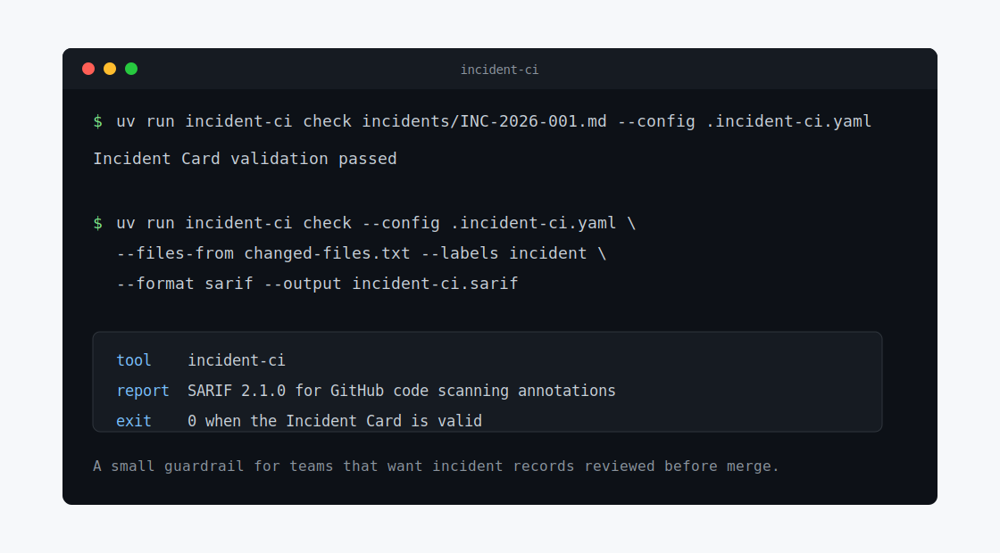

# incident-ci

`incident-ci` is a small CLI and GitHub Action for one awkward but important rule:
if a pull request is about an incident, it must carry a valid Incident Card before it can merge.

Incident response already has enough loose ends. This project keeps the record in the repository,
validates it in CI, and reports problems on the actual Markdown file so reviewers can fix the same
diff they are approving.



## What It Does

`incident-ci` checks Markdown files that contain exactly one YAML `incident_card` block. In a pull
request, it can read the changed-file list, look at the PR labels, and decide whether an Incident
Card is required.

The default path is:

```text
incidents/**/*.md
```

When validation fails, the command exits with a non-zero code and can write a text, JSON, or SARIF
report. The SARIF report is meant for `github/codeql-action/upload-sarif`, which gives you GitHub
code scanning annotations on real files from the PR head commit.

## Why This Exists

Many teams ask for incident details in pull request descriptions, Slack threads, or issue comments.
Those places are easy to skip, hard to review, and poor targets for inline CI annotations.

`incident-ci` takes the narrower path:

- the Incident Card lives in the repo;
- the card is versioned, diffed, and reviewed like code;
- GitHub can annotate the exact file and line that failed validation;
- CI blocks only when the repository policy says the PR needs a card.

No database, no daemon, no service account with broad GitHub API access. Just a deterministic check
that runs where the code already runs.

## Quick Start

Install the runtime dependencies with `uv`:

```bash
uv sync --frozen
```

Validate one Incident Card locally:

```bash
uv run incident-ci check incidents/INC-2026-001.md --config .incident-ci.yaml
```

Expected output:

```text
Incident Card validation passed
```

Validate the files changed in a pull request:

```bash
git diff --name-only --diff-filter=AM origin/main...HEAD > changed-files.txt

uv run incident-ci check \
  --config .incident-ci.yaml \
  --files-from changed-files.txt \
  --labels incident \
  --format sarif \
  --output incident-ci.sarif
```

If `--labels` does not include a required label, the check exits successfully and does not require an
Incident Card. If the required label is present and no matching incident file changed, the check
fails.

## Configuration

Create `.incident-ci.yaml` in the repository root:

```yaml
schema_version: 1
required_labels:
  - incident
exempt_labels:
  - incident-card-exempt
strict: true
incident_file_globs:
  - incidents/**/*.md
allowed_services:
  - payment-api
  - auth-api
  - order-api
```

The most common change is `allowed_services`. Keep the names lowercase and kebab-case, because the
Incident Card schema uses the same format.

## Incident Card

An Incident Card is a Markdown file with one fenced `yaml` or `yml` block. The YAML document must
have a top-level `incident_card` key.

````markdown
# INC-2026-001

```yaml
incident_card:
  schema_version: 1
  id: INC-2026-001
  status: detected
  title: Payment API latency spike
  severity: high
  environment: production
  service: payment-api
  commander: "@alice"
  detected_at: "2026-01-15T08:10:00Z"
  mitigated_at: null
  resolved_at: null
  description: "Payment API latency exceeded the SLO for checkout requests."
  impact: "Checkout requests were delayed for users in the EU region."
  mitigation: null
  root_cause: null
  postmortem_link: null
  logs: "https://logs.example.com/query/incident-2026-001"
```
````

See [docs/SCHEMA.md](docs/SCHEMA.md) for the full field list, status rules, severity rules, and
invalid examples.

## GitHub Action

The repository includes a workflow in [.github/workflows/incident-card.yml](.github/workflows/incident-card.yml).
The important parts are:

```yaml
name: Incident Card

on:
  pull_request:
    types:
      - opened
      - edited
      - synchronize
      - labeled
      - unlabeled

permissions:
  contents: read
  pull-requests: read
  security-events: write

jobs:
  incident-card:
    runs-on: ubuntu-latest

    steps:
      - uses: actions/checkout@v4
        with:
          fetch-depth: 0

      - name: Build changed file list
        run: |
          git diff --name-only --diff-filter=AM \
            "${{ github.event.pull_request.base.sha }}" \
            "${{ github.event.pull_request.head.sha }}" > changed-files.txt

      - name: Install incident-ci
        run: uv sync --frozen

      - name: Validate Incident Card
        run: |
          uv run incident-ci check \
            --config .incident-ci.yaml \
            --files-from changed-files.txt \
            --labels "${{ join(github.event.pull_request.labels.*.name, ',') }}" \
            --format sarif \
            --output incident-ci.sarif

      - name: Upload SARIF
        if: always()
        uses: github/codeql-action/upload-sarif@v3
        with:
          sarif_file: incident-ci.sarif
          category: incident-card
```

For production repositories, pin third-party actions to commit SHAs.

More integration notes live in [docs/INTEGRATION.md](docs/INTEGRATION.md).

## Validation Rules

The validator checks both shape and intent:

- the Markdown file has exactly one Incident Card YAML block;
- the YAML root is a mapping with `incident_card`;
- unknown fields are rejected;
- `id`, `status`, `severity`, `environment`, timestamps, URLs, and text lengths match the schema;
- high and critical incidents require a commander and impact;
- critical incidents require logs;
- mitigated and resolved incidents require the right timestamps and narrative fields;
- timestamps must be timezone-aware and ordered correctly;
- `service` must be listed in `allowed_services`.

The PR body is deliberately not a source of truth. It can link to the Incident Card, but it is not
validated as the card itself.

## Reports and Exit Codes

Choose a report format with `--format`:

```bash
uv run incident-ci check incidents/INC-2026-001.md --format text
uv run incident-ci check incidents/INC-2026-001.md --format json
uv run incident-ci check incidents/INC-2026-001.md --format sarif --output incident-ci.sarif
```

Exit codes:

| Code | Meaning |
|---:|---|
| `0` | Validation passed, or the PR does not require an Incident Card. |
| `65` | The Incident Card is missing or invalid. |
| `66` | An input file could not be read. |
| `70` | An unexpected internal error occurred. |
| `78` | The configuration file is invalid. |

## Project Boundaries

The current version is intentionally an MVP. It is a stateless CLI and composite GitHub Action. It
does not include a web UI, API server, queue, database, issue integration, custom GitHub Checks
reporter, or background worker.

That is deliberate. The first job is to make incident records reviewable and enforceable in pull
requests without adding another service to operate.

## Development

This project targets Python 3.12 exactly.

```bash
uv sync --frozen --group dev
uv run ruff format --check src tests
uv run ruff check src tests
uv run mypy src
uv run pytest
```

The test suite covers parsing, config loading, file selection, validation, reporters, and the CLI.
Coverage is required to stay at or above 90%.

This project was developed with AI assistance and is maintained by the author.
